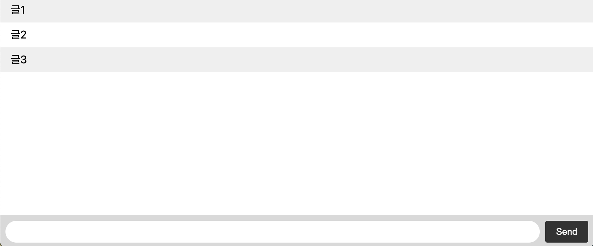

💬 Socket.IO 채팅 예제

이 저장소는 Socket.IO 공식 튜토리얼에서 사용하는
아주 간단한 실시간 채팅 예제의 소스코드입니다.

🟢 실행 방법

1. 프로젝트 루트에서 다음 명령어로 서버 실행

```
node index.js
```

2. 실행하면 서버는 다음과 같이 멀티 포트로 실행됩니다:

http://localhost:3000, http://localhost:3001, …

3. 브라우저에서 index.html 파일 열기

- VSCode 사용자: 우클릭 → “Live Server로 열기”
- 또는 파일 경로 직접 열기:

```
file:///Users/your-name/path-to-project/index.html
```

- 또는 http://localhost:3000 접속 (서버에서 서빙하는 HTML 열기)
- 채팅 메시지를 입력하면 MongoDB에 저장되고, 실시간으로 다른 클라이언트에게 전송됩니다.



🍃 MongoDB 연동 확장 버전

기존 예제는 메시지를 SQLite에 저장하지만,
이 확장 버전은 MongoDB에 메시지를 저장하도록 변경되었습니다.

🔧 실행 방법

1. 의존성 설치

```
npm install
```

2. MongoDB 실행
   로컬에서 MongoDB가 실행 중이어야 합니다. (기본 포트: localhost:27017)

macOS + Homebrew 사용 시:

```
brew services start mongodb/brew/mongodb-community@5.0
```

3. 서버 실행

```
node index.js
```

---

💾 MongoDB 저장 구조 (messages 컬렉션)

메시지는 chat 데이터베이스 안의 messages 컬렉션에 저장됩니다.

- id: MongoDB의 고유 ID
- content: 메시지 내용
- client_offset: 클라이언트가 보낸 고유 메시지 ID
- createdAt: 생성 시간
- updatedAt: 수정 시간 (mongoose 자동 생성)

---

📦 주요 기술 스택

- Node.js
- Socket.IO
- MongoDB + Mongoose ODM
- Socket.IO Cluster Adapter (멀티코어 병렬 처리)

---

🔄 주요 기능

- 실시간 채팅 기능 (Socket.IO 기반)
- MongoDB에 메시지 영구 저장
- serverOffset을 이용한 메시지 복구 기능
- 멀티코어 서버 지원 (cluster 활용)
